# Enterprise AI Architecture-to-Production

**Practitioner Showcase · AI Architecture & Delivery**

A practitioner showcase demonstrating how an enterprise AI initiative can be led from the initial request through discovery, assessment, architecture, pilot validation, production implementation, controlled go-live, operations, and recertification.

The showcase is organized around an **Architecture-to-Production Methodology** with **6 phases and 22 steps**, plus a **Methodology in Practice** library containing **15 illustrative enterprise AI scenarios and 330 completed customer-style deliverables**.

> The scenarios and artifacts in this repository are illustrative and non-client. They are designed to demonstrate architecture, governance, delivery, and decision-making practices without using confidential or proprietary customer information.

---

### Live Demo

**Explore the interactive showcase:**  
https://danvzla.github.io/ai-architecture-to-production/

# What this repository demonstrates

This project is designed to show more than a final architecture diagram. It demonstrates the practitioner work required to move an AI initiative from an idea into a governed, supportable production service.

It focuses on four questions at every step:

1. **What do I do?**
2. **What do I consider?**
3. **What decision or gate do I manage?**
4. **What customer deliverable do I produce?**

---

# Architecture-to-Production MOP

> **Diagram note:** GitHub automatically adds zoom, pan, and copy controls to Mermaid diagrams. The diagrams below are intentionally vertical and compact to reduce horizontal scrolling and visual clutter.

The MOP provides a repeatable structure for progressing an enterprise AI initiative through six connected phases:

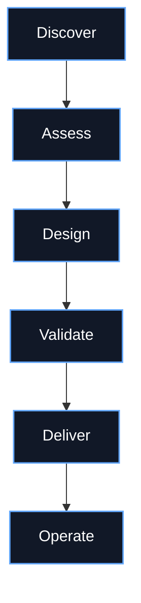

The lifecycle is intentionally broader than architecture design alone. It includes business framing, AI suitability, readiness, governance, architecture decisions, pilot validation, production readiness, implementation, service transition, operations, and recertification.

---

# 6 Phases · 22 Steps

## Phase 1 — Discover

Establish why the initiative exists, what outcome is expected, who must be involved, and what the current environment looks like.

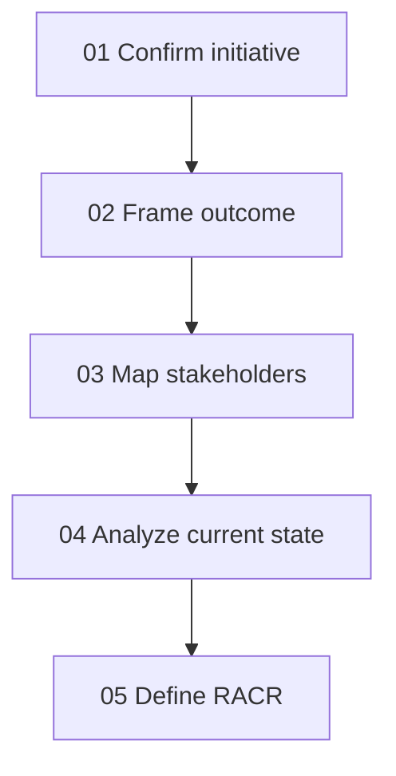

**Primary focus**

- Initiative definition
- Business outcome framing
- Stakeholder alignment
- Current-state evidence
- Roles, accountability, consultation, and review

---

## Phase 2 — Assess

Determine whether AI is appropriate, whether the organization is ready, and whether the use case should move forward.

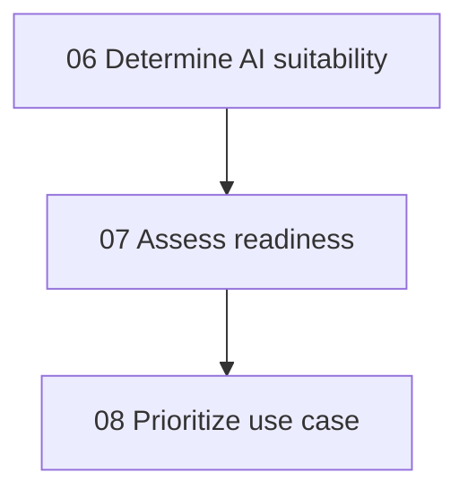

**Primary focus**

- AI suitability
- Data and knowledge readiness
- Security and governance readiness
- Delivery and operating maturity
- Use-case priority
- Business value versus complexity and risk

---

## Phase 3 — Design

Translate the approved use case into an architecture that is technically feasible, governable, secure, measurable, and supportable.

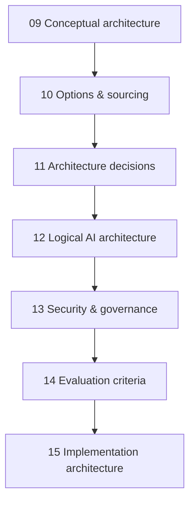

**Primary focus**

- Architecture patterns
- Build / buy / partner decisions
- Deployment options
- Model, platform, RAG, agent, and integration design
- Architecture Decision Records
- Security controls
- Responsible AI
- Evaluation design
- Implementation topology

---

## Phase 4 — Validate

Test the architecture and prove that the proposed solution is ready to move toward production.

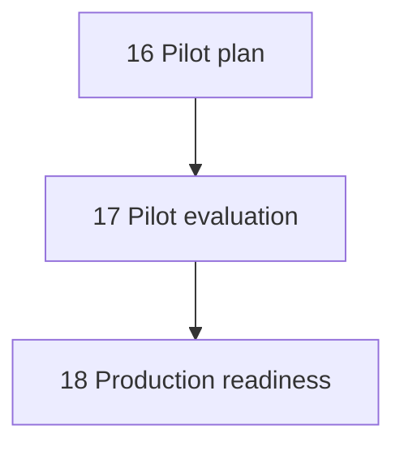

**Primary focus**

- Pilot scope
- Acceptance criteria
- Evaluation evidence
- Quality and safety thresholds
- Security validation
- Operational readiness
- Productionization decision

---

## Phase 5 — Deliver

Turn the validated architecture into a production service and transition it into controlled use.

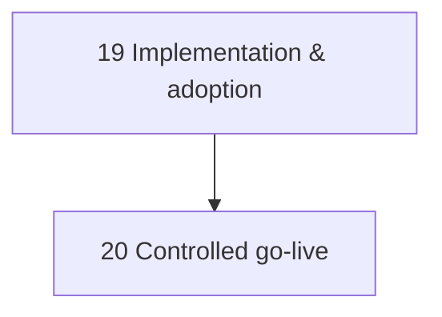

**Primary focus**

- Production implementation
- Integration
- Adoption and enablement
- Change management
- Release controls
- Canary / phased rollout
- Rollback
- Service transition

---

## Phase 6 — Operate

Operate, observe, improve, and periodically determine whether the solution should scale, change, or retire.

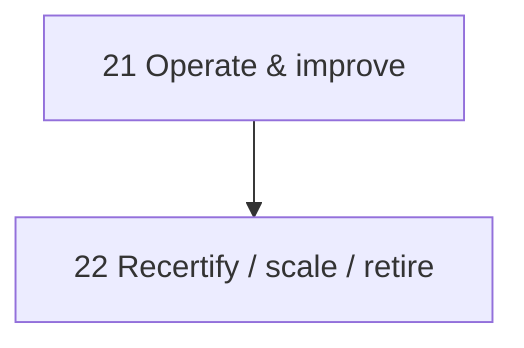

**Primary focus**

- Runbooks
- Observability
- Cost and performance
- Model / prompt / RAG quality
- Incident response
- Governance evidence
- Recertification
- Scale / modify / retire decisions

---

# End-to-End Decision Flow

The methodology is not simply a sequence of documents. Each phase contains explicit decision points.

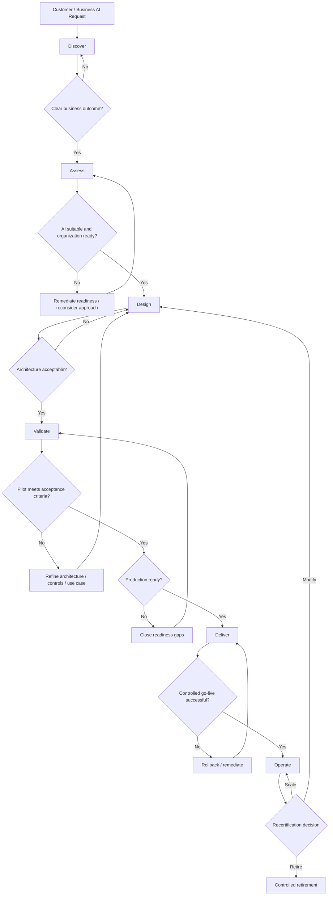

---

# Practitioner Work at Every Step

Every step follows a consistent operating pattern:

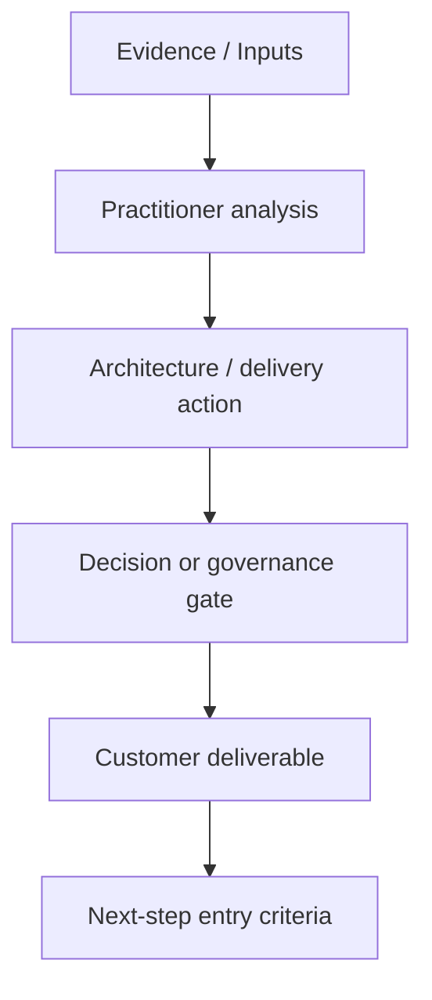

This creates traceability from **evidence → thinking → action → decision → artifact**.

---

# Cross-Cutting Workstreams

These concerns stay active across the full lifecycle instead of being handled once and forgotten.

| Workstream | What remains visible throughout the lifecycle |
|---|---|
| Business value | Outcomes, KPIs, prioritization, benefits realization |
| Data & knowledge | Quality, access, grounding, lineage, retention |
| Security & risk | Identity, privacy, controls, threats, residual risk |
| Responsible AI | Human oversight, transparency, accountability |
| Evaluation | Quality, safety, latency, reliability, acceptance criteria |
| FinOps / economics | TCO, ROI, NPV, unit cost, consumption |
| Architecture decisions | Options, tradeoffs, ADRs, standards |
| Program governance | Owners, gates, RAID, dependencies, escalation |
| Change & adoption | Training, process change, user readiness |
| Operations | Runbooks, observability, incidents, recertification |

These workstreams help prevent the common failure mode of treating AI architecture as only a model-selection or technology exercise.

---

# Governance and Decision Gates

A practitioner does not automatically move an initiative from one phase to the next.

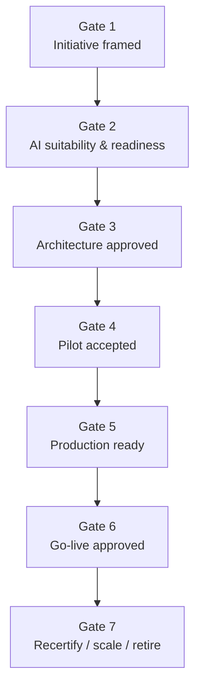

Typical evidence considered at these gates includes:

- Business value and measurable outcomes
- Data quality and knowledge availability
- Security and privacy requirements
- Responsible AI controls
- Architecture feasibility
- Operational capability
- Evaluation results
- Cost / TCO / ROI considerations
- Adoption and support readiness
- Risk acceptance and residual risk

---

# Artifact Flow

The deliverables mature as the initiative progresses.

| Lifecycle area | Representative customer outputs |
|---|---|
| Discover | Initiative brief, outcome framing, stakeholder map, current-state assessment, RACR |
| Assess | AI suitability assessment, readiness assessment, prioritized use case |
| Design | Conceptual architecture, options/sourcing analysis, ADRs, logical architecture, security/governance design, evaluation criteria, implementation architecture |
| Validate | Pilot plan, pilot evaluation, production-readiness decision |
| Deliver | Implementation/adoption plan, go-live and service-transition record |
| Operate | Operations runbook, observability model, recertification decision |

The interactive showcase provides a visual template for every one of the 22 steps.

---

# Methodology in Practice

The second part of the showcase applies the same 22-step methodology to **15 illustrative enterprise AI scenarios**.

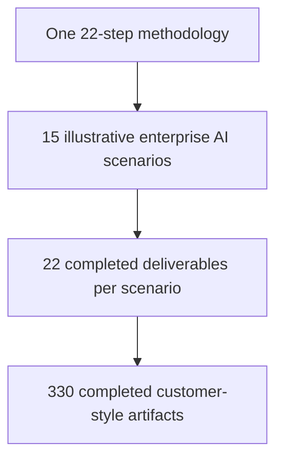

**15 scenarios × 22 deliverables = 330 completed customer-style artifacts**

The scenario library demonstrates how the same architecture-to-production method adapts to different:

- Industries
- Business outcomes
- Architecture patterns
- Data environments
- Security boundaries
- Governance controls
- Delivery models
- Operating requirements

The scenarios are intended to be used as worked examples for learning, comparison, workshop preparation, and inspiration for other enterprise AI initiatives.

---

# Methodology vs. AI Architecture Advisor

This repository represents the **broader practitioner lifecycle**.

The separate **AI Architecture Advisor** is an **8-agent AI architecture accelerator** that supports selected discovery, assessment, and design activities.

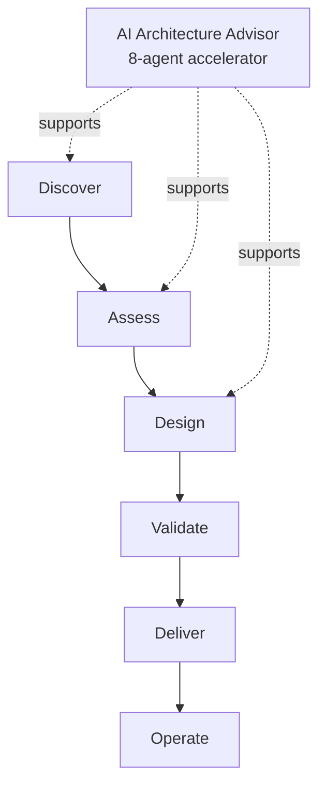

The Advisor can transform enterprise discovery inputs into outputs such as:

- Reference architectures
- ADRs
- Governance controls
- 30/60/90 implementation roadmap
- TCO / ROI / NPV business case

It does **not** replace the broader practitioner responsibilities for pilot validation, production readiness, implementation, controlled go-live, operations, and recertification.

---

# Repository Structure

```text
/
├── index.html
├── README.md
├── .nojekyll
├── Enterprise-AI.jpeg
└── images/
    ├── templates/
    │   ├── step-01-template.png
    │   ├── ...
    │   └── step-22-template.png
    └── scenarios/
        ├── scenario-01/
        │   ├── step-01.png
        │   ├── ...
        │   └── step-22.png
        ├── ...
        └── scenario-15/
```

---

# Explore the Showcase

The interactive website allows visitors to:

- Navigate all 6 phases
- Explore all 22 methodology steps
- Review practitioner actions and decision gates
- Open the customer deliverable template associated with each step
- Switch to **Methodology in Practice**
- Select from 15 illustrative enterprise AI engagements
- Review all 22 completed artifacts for each scenario

---

# Portfolio Integrity

All projects, scenarios, architecture examples, figures, timelines, and deliverables are illustrative and use non-client data.

They are intended to demonstrate architecture, AI delivery, governance, technical program leadership, and practitioner decision-making. They should not be interpreted as customer results, confidential work product, or vendor-endorsed guidance.

---

## Author

**Daniel Mazzini**  
Principal Solutions Architect & Senior Technical Program Manager  
SolTelCo Advisory

**Portfolio:** https://www.soltelco.com
